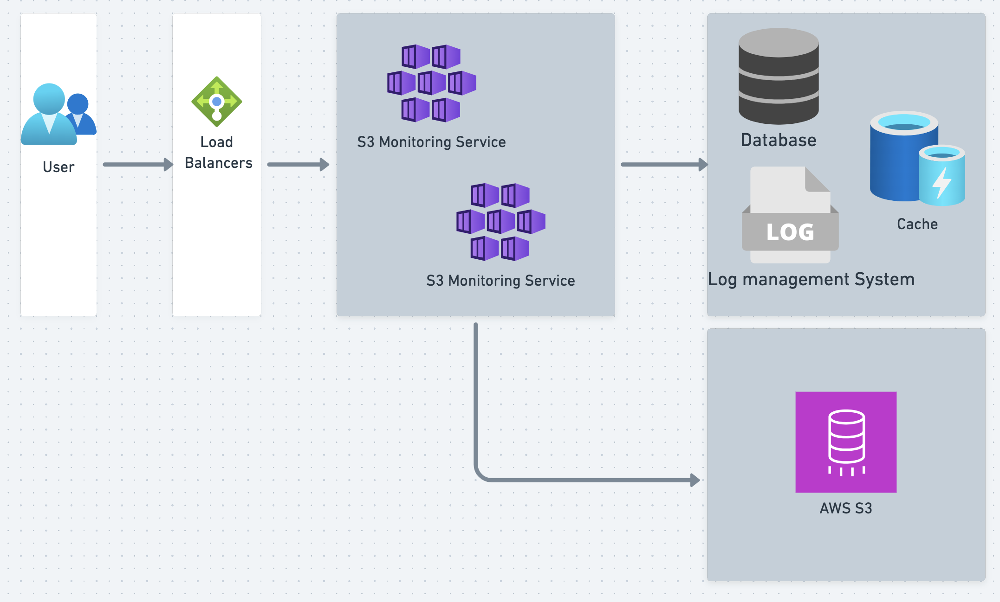

# Project Name
S3 Monitoring Service Project

## Getting Started

This service allows users to upload files, which are then stored in Amazon S3. Amazon S3 is a scalable, secure and durable object storage service from Amazon Web Services. When a file is uploaded through this service, it receives the file, possibly processes it (like validating, resizing images, etc.), and then transfers it to an S3 bucket.

### Prerequisites

What things you need to install the software and how to install them:

- Node.js
- npm
- Docker
- Docker Compose

### Diagarm 

### Installing

A step by step series of examples that tell you how to get a development environment running:

1. Clone the repository:

git clone https://github.com/huynhvogiakhang/upload-s3-monitoring-service

2. Navigate into the project directory:

cd project

3. Install the dependencies:

npm install

4. Start the development server:

npm run start

Now, navigate to http://localhost:3000 in your browser to see the application running.

###  Docker Compose

This project can be run using Docker Compose. This will create a container for the application itself and another for the database that it connects to.

Running the project with Docker Compose

1. Build the Docker images:

docker-compose build

2. Start the Docker containers:

docker-compose up

Now, the application and the database are running in two separate Docker containers.

To stop the Docker containers, you can use the following command:

docker-compose down

Accessing the application
The application will be accessible at http://localhost:3000, and the database will be accessible at the port you specified in your Docker Compose file.

### API

Swagger Document: [http://localhost:3000/swagger](http://localhost:3000/swagger)

Our API provides two main endpoints:

1. `POST /login`: Used for user authentication. Send a POST request with your user credentials in the body to receive an access token.

2. `POST /upload`: Used for file uploads. Send a POST request with the file you want to upload in the body. This endpoint may require authentication, so include the access token from the `/login` endpoint in your request header.

[Postman Collection JSON](./S3 Monitoring Service.postman_collection.json)

### Built With
NestJS - A progressive Node.js framework for building efficient, reliable and scalable server-side applications.

### Authors
Huỳnh Võ Gia Khang

